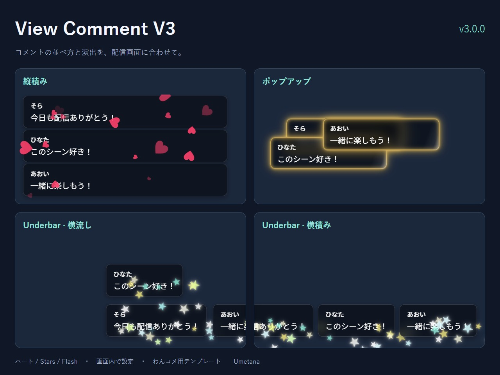

# View Comment V3 v3.0.0

配信画面に合わせて、コメントの並べ方と演出を選べる、わんコメ用テンプレートです。

## できること

- **縦積み**：コメントを縦に並べる基本表示。
- **ポップアップ**：画面全体へランダムに、または指定位置の周辺へ重ねて表示。
- **Underbar**：画面下部を横に流す、または新着で横へ押し出して表示。横流しは最大5レーン。
- **コメントの演出**：ハート、Stars（星降り）、Flash（枠発光）を選択。演出なしにもできます。
- 文字・色・サイズ・表示時間などをOBSの画面内設定で調整できます。

## はじめに

[わんコメ](https://onecomme.com/)とOBS Studioが必要です。このテンプレートだけではコメントを取得できません。初期設定は「縦積み＋支援・メンバー通知にハート」です。

1. ZIPを展開し、`view_comment_V3`フォルダをわんコメのカスタムテンプレートフォルダへ入れます。フォルダ直下に`index.html`がある状態にしてください。
2. わんコメのテンプレート一覧から「View Comment V3」をOBSへドラッグ＆ドロップします。
3. OBSのブラウザソースの幅・高さを、コメントを表示したい範囲に合わせます。全面ポップアップなら配信画面と同じ大きさにします。
4. わんコメでコメントを受信し、表示を確認します。

確認環境：Windows／OBS Studio 32.2.2（64bit）／わんコメ9.2.0-alpha18。正式版を含む他バージョンは未確認です。

## 設定を変える

OBSで対象ソースを右クリックして「対話」を開き、**描画エリアの右下**へマウスを移動すると歯車が現れます。

- 「コメントの表示方式」で並べ方、「コメント枠の演出」で装飾を選びます。
- スライダーはドラッグ、横の数値欄は直接入力・上下ボタン・↑↓キーで調整できます。直接入力はEnterまたは欄を離れて確定します。
- 調整中はプレビューです。**「保存して再読み込み」で保存**してください。閉じると未保存の調整を取り消します。
- 保存・再読み込みや方式変更でコメントの表示が作り直されるため、配信前の調整がおすすめです。

Underbarの「空き優先」は下段を優先します。ゆっくりした受信でも全段を使うなら「順番」、不規則に振り分けるなら「ランダム」を選んでください。

## 困ったとき

| 症状 | 確認するところ |
|---|---|
| コメントが出ない | わんコメ本体で受信できているか、フォルダが二重になっていないか、ソースを再読み込みしたか |
| 設定の歯車が見つからない | OBSの「対話」で、コメントの端ではなくブラウザソース全体の右下へ移動 |
| 演出が出ない | 初期対象は支援・メンバー通知。「すべて」に変えて通常コメントでも確認 |
| カードが小さい | ポップアップ・Underbarは「カード全体の倍率」、縦積みは文字サイズなどを調整 |
| 長文が省略される | Underbarは一行省略の仕様。最大幅を広げるか、他の表示方式を使用 |
| 星や光が切れる・重なる | ソースの大きさ、カード位置、横・上下の間隔を調整。装飾はカードの外へ広がります |

## 設定の保存・更新

設定はOBS側の保存領域に保存されます。別ブラウザとの共有は前提にしていません。用途別にフォルダを別名で複製すると設定を分けられます。**フォルダ名を変えると別設定になる**ため、更新時は同じ名前・配置を維持してください。

更新前に使用中フォルダをバックアップしてください。`config.js`を手編集している場合はそのファイルも保管してください。旧派生テンプレートからの設定自動移行はありません。

詳しい設定・HTTP運用は[SPEC.md](SPEC.md)、更新内容は[CHANGELOG.md](CHANGELOG.md)へ。

## 利用条件・問い合わせ

作者：Umetana ／ [配布元・問い合わせ先](https://umetana.booth.pm/)。わんコメ公式の製品ではありません。

本テンプレートは[MIT License](LICENSE)。同梱物のライセンス表記も保持してください。わんコメ利用時のクレジット条件は[公式利用規約](https://onecomme.com/terms/)に従ってください。無料利用時は概要欄などへの記載が必要です。FANBOX支援者は任意、概要欄がない場合や文字数制限が厳しい場合などは省略できます。

例：配信者のためのコメントアプリ「わんコメ」https://onecomme.com

不具合の連絡には、本テンプレートの版・わんコメとOBSの版・表示方式・再現手順を添えてください。
